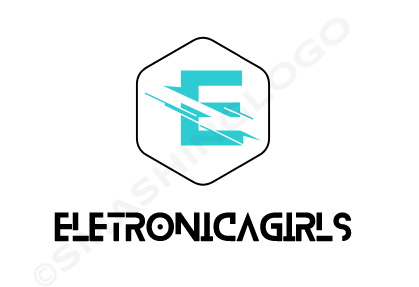

### Reunião de Fundação do grupo Eletrônica Girls**

---

Este formulário é para inscrição de participar da reunião de fundação do grupo Eletrônica Girls**

Proposta do grupo será um hub de formação de grupos de estudo:

- Criação de um código de conduta.
- Criações de grupos de estudos com inscrição de turma no site.
- Site para divulgar as inscrições dos grupos de estudos com vagas em aberto.
- Grupo no Telegram para divulgação geral (este grupo já está criado, mas não formalizado como uma comunidade).

* A comunidade tem o objetivo o protagonismo feminino. As membras formadas pode criar o grupo de estudo e pode decidir se aceita ou não aceita ter outros grupos de gênero nos encontros. Lembrando que a permissão seria liberado se todas concordarem, caso uma não concorda prevalece a vontade dela de não aceitar a entrada.

* Criação de grupos de estudo será dado sempre a liberdade para **gênero feminino**.

* A reunião de fundação será dado a liberdade apenas para o gênero feminino.

** Nome provisório

[Formulário de inscrição](https://forms.gle/SDPHqSZyyVhVXfG67)

O formulário encerrara no dia 8/1/2021 - 24h.
