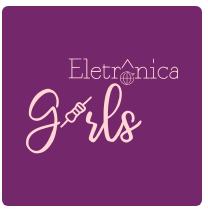

 <a style="size: 32; Background: #836FFF; color: #fff; padding: 9px; border-radius: 4px;" href="https://eletronicagirls.github.io/grupos-estudos/">Lista dos grupos de estudos </a> | <a style="size: 32; Background: #836FFF; color: #fff; padding: 9px; border-radius: 4px;" href="https://github.com/eletronicagirls/eletronicagirls.github.io/wiki">Wiki - Procedimentos</a> | <a style="size: 32; Background: #836FFF; color: #fff; padding: 9px; border-radius: 4px;" href="https://eletronicagirls.github.io/sobre/">Sobre</a>

  <h3>Reunião de Fundação do grupo Eletrônica Girls**</h3>

---

Este formulário é para inscrição de participação da reunião de fundação do grupo Eletrônica Girls**

Proposta do grupo será um hub de formação de grupos de estudo:

- Criação de um código de conduta.
- Criações de grupos de estudos com inscrição de turma no site.
- Site para divulgar as inscrições dos grupos de estudos com vagas em aberto.
- Grupo no Telegram para divulgação geral (este grupo já está criado, mas não formalizado como uma comunidade).

* A comunidade tem o objetivo o protagonismo feminino. As membras formadas pode criar o grupo de estudo e pode decidir se aceita ou não aceita ter outros grupos de gênero nos encontros. Lembrando que a permissão seria liberado se todas concordarem, caso uma não concorda prevalece a vontade dela de não aceitar a entrada.

* Criação de grupos de estudo será dado sempre a liberdade para **gênero feminino**.

* A reunião de fundação será dado a liberdade apenas para o gênero feminino.

** **Nome provisório, Site provisório e Logo provisório**

<a style="size: 32; Background: #FF0000; color: #fff; padding: 9px; border-radius: 4px;" href="https://forms.gle/SDPHqSZyyVhVXfG67"><s>Formulário de inscrição</s></a> <a style="size: 32; Background: #4682B4; color: #fff; padding: 9px; border-radius: 4px;" href="https://eletronicagirls.github.io/atas-reunioes/10-01-2021">Ata da Reunião</a>

O formulário encerrara no dia 7/1/2021 - 24h.

Atribuição-NãoComercial-CompartilhaIgual
CC BY-NC-SA

 ---
 
 <a style="size: 32; Background: #FFC0CB; color: #fff; padding: 9px; border-radius: 4px;" href="https://twitter.com/eletronicagirls">Twitter</a> <a style="size: 32; Background: #FFC0CB; color: #fff; padding: 9px; border-radius: 4px;" href="https://linkedin.com/company/eletronicagirls">Linkedin</a> <a style="size: 32; Background: #FFC0CB; color: #fff; padding: 9px; border-radius: 4px;" href="mailto:eletronicagirls@gmail.com">E-mail</a> <a style="size: 32; Background: #FFC0CB; color: #fff; padding: 9px; border-radius: 4px;" href="https://github.com/eletronicagirls">Repositório GitHub</a> | 
<a style="size: 32; Background: #836FFF; color: #fff; padding: 9px; border-radius: 4px;" href="https://github.com/eletronicagirls/codigo-conduta/">Código de conduta</a> 

---

2021 - Comunidade Eletrônica Girls - Todos Direitos Reservados

