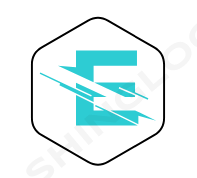

  <h3>Sobre grupo Eletrônica Girls</h3>

---
**2020 ->**

Tudo começou com um workshop administrado pelas PyladiesSP, com o tema Python com Arduino. neste workshop a palestrante criou um grupo no Telegram. Passando o ano de 2020, sem muita movimentação, mas o sonho de criar um projeto para incentivar mulheres na área de eletrônica só aumentava.

**2021 ->**

No mês de janeiro veio um xeque mate para oficialização do grupo, sendo no dia --/--/-- a data oficial da fundação.

no dia teve a presença na reunião:

## Missão
  

## Valor
  

## visão
  
  
<a style="size: 32; Background: #073ED2; color: #fff; padding: 9px; border-radius: 4px;" href="https://forms.gle/SDPHqSZyyVhVXfG">Formulário de contato</a>

Como todas são volutária, pode ocorrer demora para contato de retorno.

Atribuição-NãoComercial-CompartilhaIgual
CC BY-NC-SA

 ---
 Menu: 

[Home](https://eletronicagirls.github.io/) :-> Home Pages do site

[Lista de grupo de estudo](https://eletronicagirls.github.io/grupos-estudos/) :-> sem dados ainda!!!

[Código de conduta](https://github.com/eletronicagirls/codigo-conduta/) :-> sem dados ainda!!!

[Repositório GitHub](https://github.com/eletronicagirls) :-> Visite!!!

[Wiki - Procedimentos](https://github.com/eletronicagirls/eletronicagirls.github.io/wiki) :-> em constante atualização!!!
